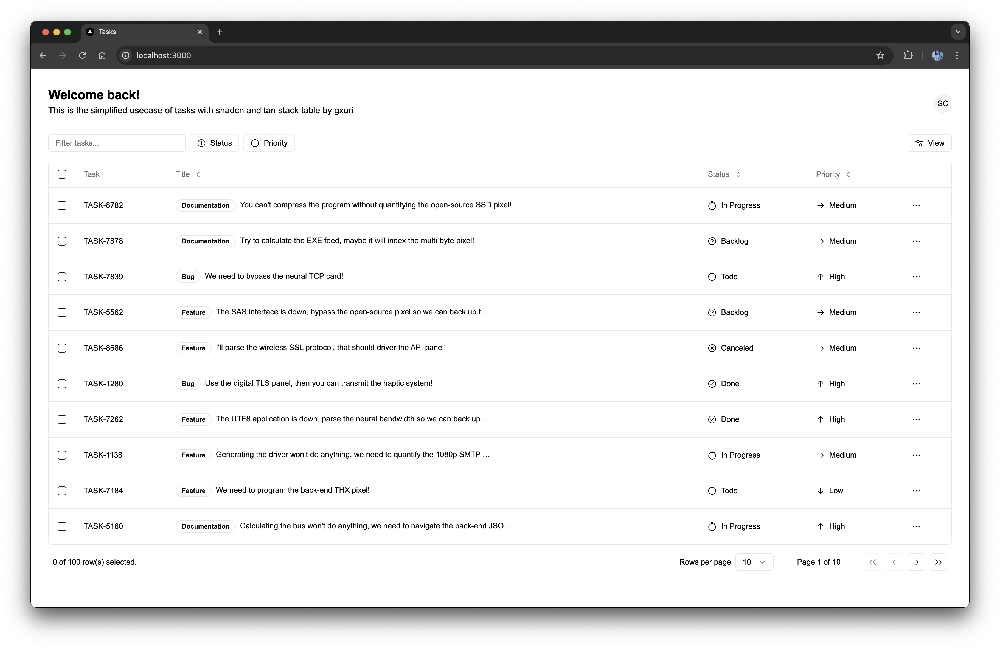

# shad-cn-tasks-simplified

This repository contains a simplified version of the [ShadCN Tasks example](https://ui.shadcn.com/examples/tasks), designed for quick cloning and easy usage.




## Features

- Clean and minimal task management interface.
- Pre-configured for immediate use.
- Based on the ShadCN UI components.

## Getting Started

### 1. Clone the repository

```bash
git clone https://github.com/Gurvinder-singh02/https://github.com/Gurvinder-Singh02/shad-cn-tasks-simplified.git
```

### 2. Install dependencies

Navigate to the project directory and install the required dependencies:

```bash
cd shad-cn-tasks-simplified
npm install
```

### 3. Run the application

To start the development server:

```bash
npm run dev
```

Open your browser and navigate to `http://localhost:3000` to view the app.

## Customization

Feel free to modify and extend the task management UI as needed. The project is pre-configured for rapid development and deployment.

## License


Enjoy your streamlined task manager built with ShadCN!